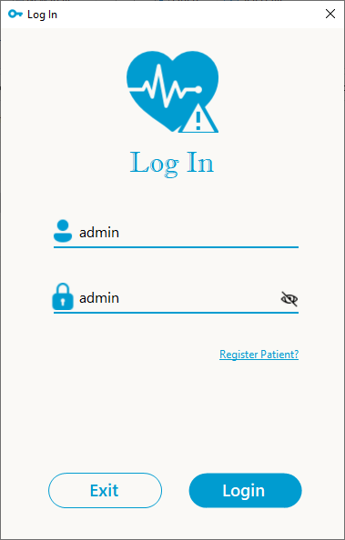
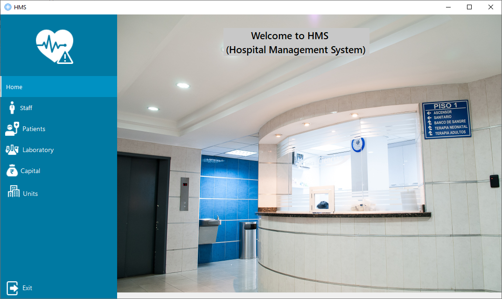
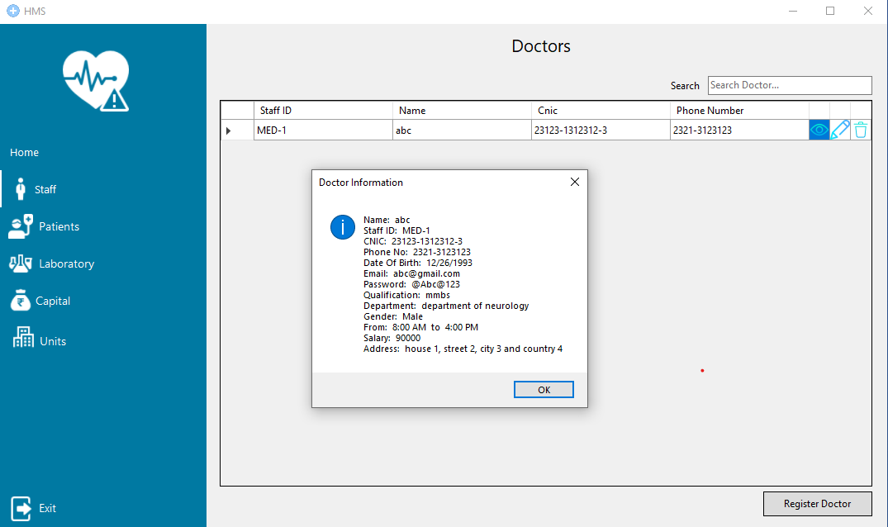
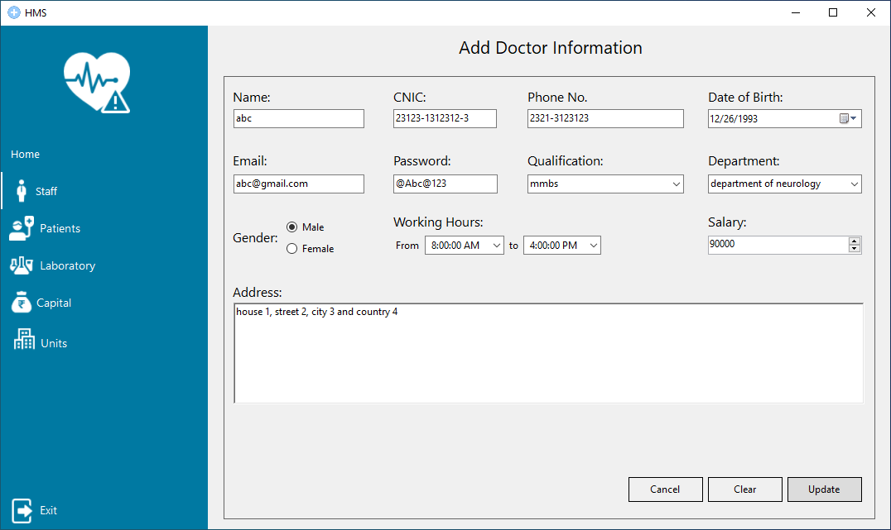
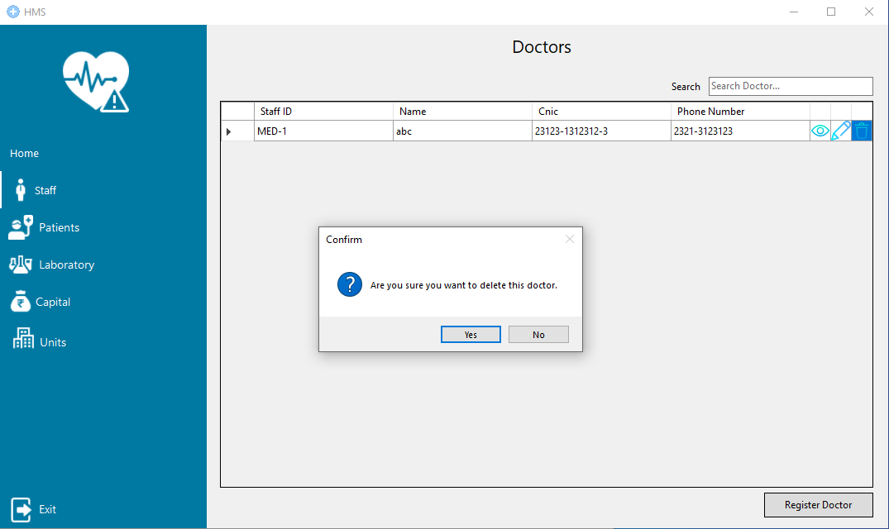

<h1 align="center">Hospital-Management-Desktop-Application (Incomplete)</h1>
<h3 align="center">A C# desktop application that implements hospital management system that will manage the record of doctors, patients etc.</h3>

---

 

## Project Description

Human life is very precious and consists of very complicated structure and millions of functions. The health sector should provide the best medical facilities to a
common person. As Pakistan is a developing nation in the field of health sciences and developing a large scale of hospitals but facing a large number of problems
in inter-structure facilities. The basic working of administration in various hospitals of Pakistan is still on paper which makes the process a lot slower as compared
to the hospitals in Europe because there the computers have been put in to assist the hospital personnel in their work.

The concept of automation in the management of hospitals should now be implemented in Pakistan. Our project is aimed to achieve and realize the above concept i.e.
automated administration of Hospital. Hospital management system (HMS) aims to provide the benefits of streamlined operations, enhanced administration
and control, superior patient care, pharmacy, medical labs, and strict cost control. Hospital management app implements hospital management system with a desktop
application Interface that will manage the data related to any particular hospital.

# Developer Remarks
The project was not completed due to the lack of developers. If you want to contribute to health sector by making this application closer to its orginal purpose than
you are very much welcome to join us. Many a little makes a mickle, so contribute as much as possible.

 

## Project GUI

### Login Screen :

_To login to the system you have to enter **admin** as both the username and password. The system progress stopped in its development phase so the other emails are not 
allowed at the moment._

 

### Home Screen :

_After logging in the user will be taken to the home page of the application here you will be able to access the system through the menu given at the left. To exit
simply close the window or clicl the **Exit** button at the bottom of the side menu_

 

### Doctors :

_You can view all the doctor available in the system here. You can even search for the required doctor by using the search bar given at the top of the doctor table.
You can also add info of a new or update info of an existing doctor. Now by clicking the update button against the doctor of row 1 we go to the update page_

 

_This page remains the same for the update and add functionality of the doctor. You have to enter the information about the doctor in their respective fields. Be 
careful about the password as it should conatin atleast 1 capital, 1 small, 1 numeric and 1 special letter. The CNIC should also match the gender as the CNIC ending
with odd letter is male otherwise female._

 

_By clicking on the view button against a doctor row will display that doctor information in the form of a pop up._

 

_By clicking on the delete button against a doctor row will show a confirmation pop up. After confirming that doctor data will be deleted._
